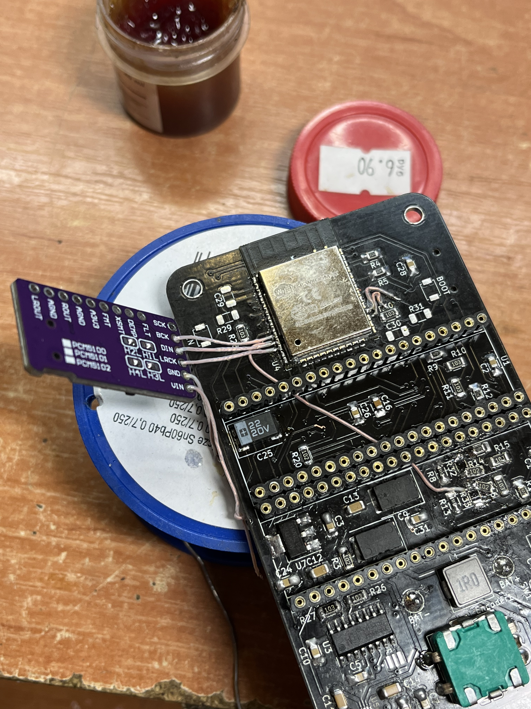
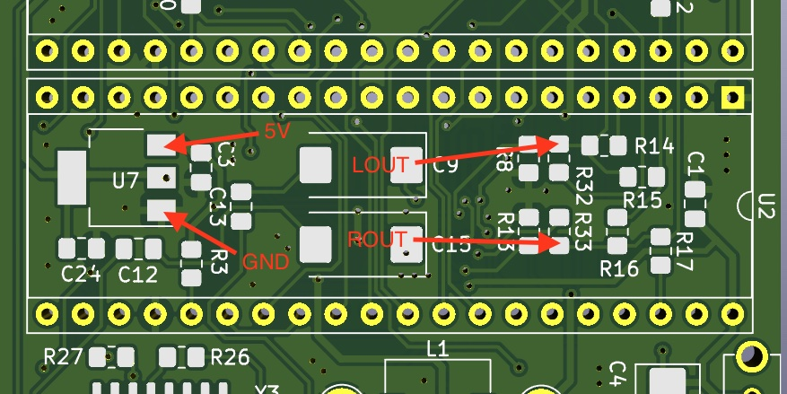

# ZxPod Player withexternal DAC use
## Revisions A,B and C.

You may use external DAC like PCM5102A module.

### First prepare PCM5102A module

1. Solder SCK jumper on top side.
2. Solder jumpers on bottom side: 1 - LOW, 2 - LOW, 3 - HIGH, 4 - LOW

### Prepare ZxPod
1. Remove R18, R19, R32, R33 (on revisions A,B and C).
2. Connect BCK DAC pin to GPIO25, DIN DAC pin to GPIO26, LRCK DAC pin to GPIO27 (see Fig.1)
3. Connect VIN DAC pin to 5V on player and GND DAC pin to GND on player (You may use 3,3V linear regulator pins on player PCB, see Fig.2)
4. Connect LROUT DAC pin to LOUT pad R32 (see Fig.2), ROUT DAC pin ROUT pad R33 (see Fig.2)
5. Fix the module, for example, with double-sided tape to the ESP32 module as shown in Fig. 3

External DAC support starting from firmware version 3.41.
Also fast firmware flash avaliable on [Alex Spawn OTA web page](https://ota.alexspawn.ru)
