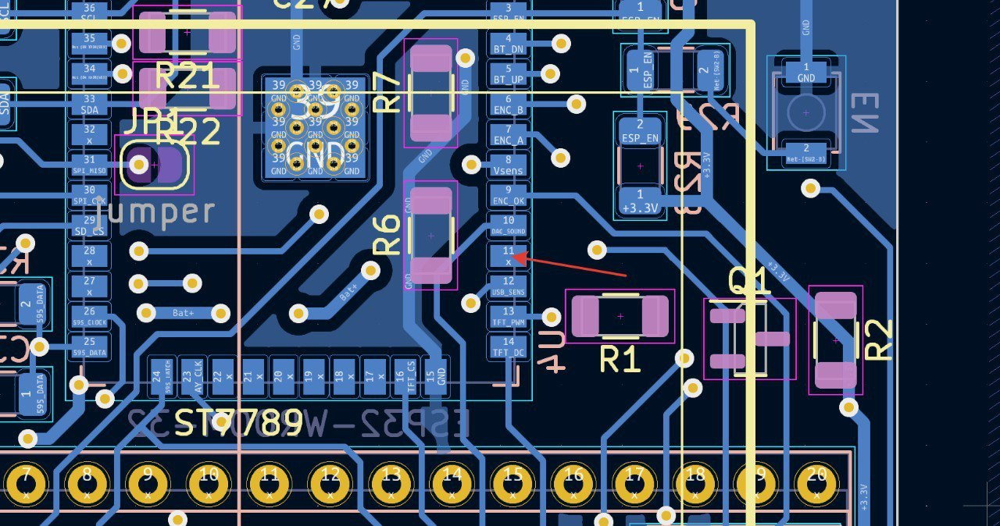
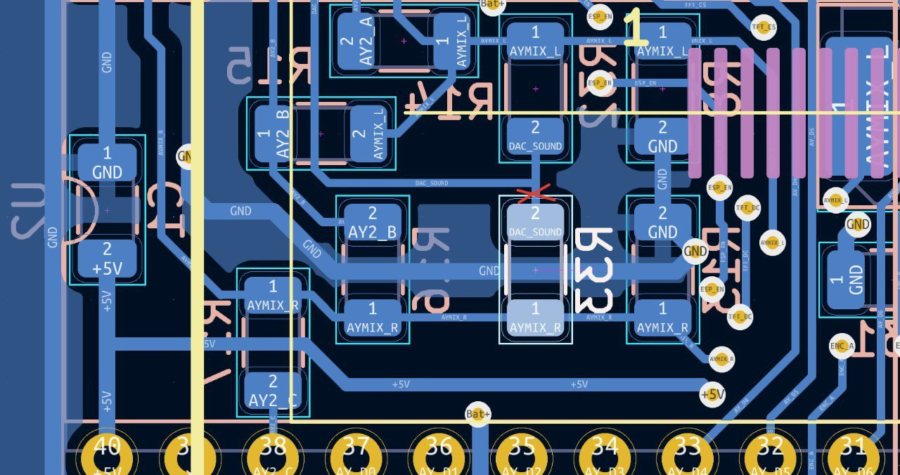
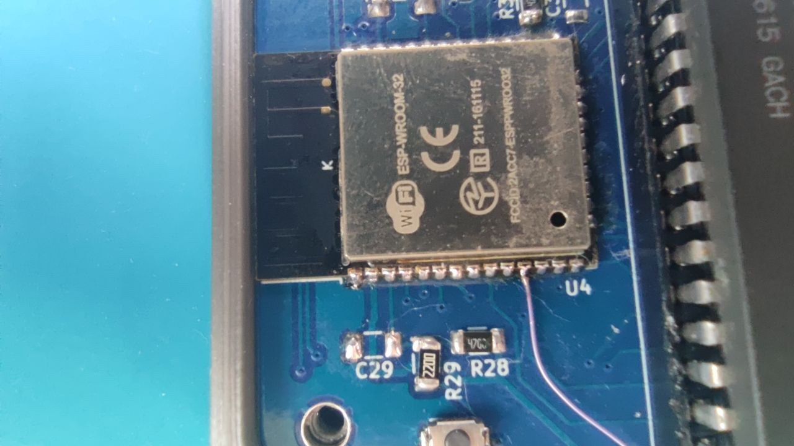
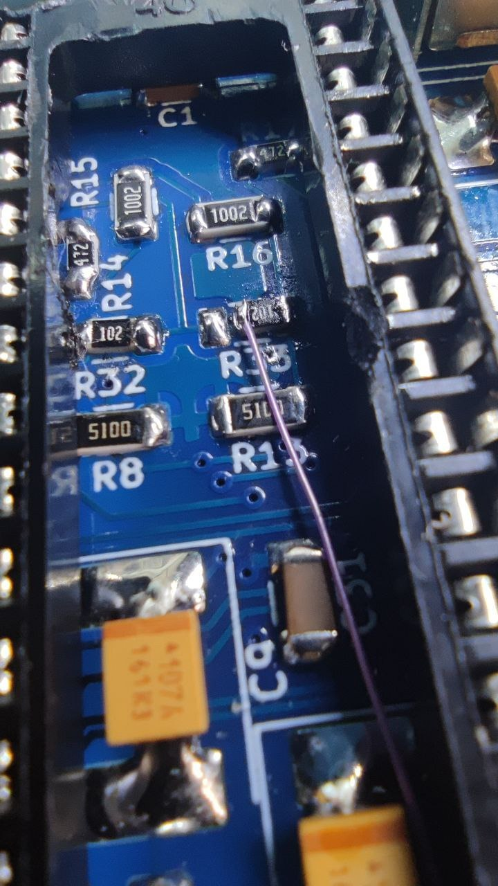
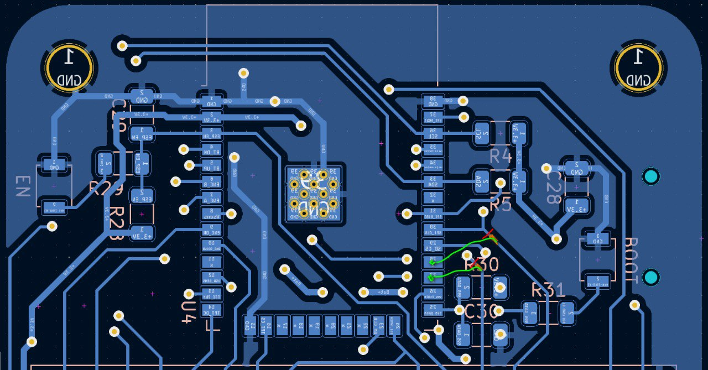

# ZxPod - multiformat Turbo Sound player
ESP32 based AY Turbo Sound multiformat player

## Fast flash firmware avaliable on [Alex Spawn OTA web page](https://ota.alexspawn.ru)

## Starting with firmware version 3.41 - added support for external DAC's - read [External DAC](PCB/ExternalDAC)

## IMPORTANT:
Firmwares from version 3.4 supports only PCB revision C! But you can soldering upgrade revision A and B to C:

Cut JP1 jumper on revisions A and B first!

### From rev.A to B and C:
You need to cut the input track on the resistor R33(see Pic.2) and solder the wire from the ESP32 (see Pic.1) to the cut contact of the resistor. See the images below.

### From rev. A and B to C:
You need to cut the tracks as shown in Figure 5 (red cut lines), then carefully strip the tracks from the solder mask and solder the wires (green lines) to the ESP32.

## Features
### Supported formats:
- .ayl - [Ay_Emul](https://bulba.untergrund.net/emulator_e.htm) by Sergey Bulba own playlist format
- .pt1 - Pro Tracker v1 file format
- .pt2 - Pro Tracker v2 file format
- .pt3 - Pro Tracker v3 (include Turbo Sound on two AY chips) file format
- .stc - Sound Tracker file format
- .stp - Sound Tracker Pro file format
- .asc - Sound Master file format 
- .psc - Pro Sound Creator file format
- .sqt - SQ Tracker file format
- .ay  - AY file format
- .psg - Programmable Sound Generator file format
- .rsf - Registers Stream Flow file format
- .yrg - [Custom AVR-AY format](https://www.avray.ru/ru/avr-ay-player/)
- .mod - Amiga MOD tracker format designed for creating, storing and playing music on an Amiga PC
- .s3m - (Scream Tracker 3 Module) is a module file format, based on the original MOD format used on the Amiga computer.
- .xm  - The XM file format, also known as Extended Module, is a digital audio file type for music created in the FastTracker 2 software.
- .tap - A file format for emulating ZX Spectrum magnetic tape images, which stores data from standard Sinclair BASIC procedures for working with a cassette.
- .tzx - A file format used to store programs and games for the ZX Spectrum computer as audio data from magnetic tape.
- .mp3 - MP3 (MPEG-1 Audio Layer 3) is a widely used digital audio format that uses a lossy compression method to significantly reduce file size while maintaining near-CD quality audio.
- .wav - is an audio file format for storing uncompressed audio data, developed by Microsoft and IBM. It is known for high-quality audio that retains all original data, but results in large file sizes, making it popular for professional audio recording and editing. The format stores audio data in chunks and commonly uses linear pulse-code modulation (LPCM) for encoding.
- UART mode (available in player settings menu as Player source)
- SD forwarding via USB as Mass Storage device (rev.D and above only)

### Controls
- Before player turning on - hold left button and turn on player to enter root config (needed for change encoder type). Encoder types:
    1. STEP 4L - active low (pull-up to VCC). Full cycle (4 phases) per click.
    2. STEP 4H - active high (pull-up to GND). Full cycle (4 phases) per click
    3. STEP 2 - half cycle (2 phases) per click (Set by default)
    4. STEP 1 - quarter cycle (1 phase) per click, and non-latching encoders
- Before player turning on - hold right button and turn on player to reset config to default.
- Before player turning on - hold encoder button and turn on player to reset last playing track (if player freezes or reboot on this file).
- Encoder Hold - change mode player/file browser
- Encoder Click - in player mode - play/pause; in file browser mode select track/playlist/directory; select - in config mode
- Encoder Double click - in player mode - open settings
- Encoder Push and turn right - fast forward (for ay format change next subsong, for tape formats - change next block)
- Encoder Push and turn left - slow down (for ay format change previous subsong, for tape formats - change previous block)
- Left button click/hold - volume - (in player mode); cancel - in config mode
- Right button click/hold - volume + (in player mode)
- Left button double click - change AY clock (in player mode) for PSG formats or change stereo panning for formats over DAC (mod,s3m etc.)
- Right button double click - change play mode: all/shuffle/once (in player mode)
- Right button hold and encoder click - remove file (only files, only in file browser).

### Playing modes:
- Playing all tracks (in folder/playlist)
- Playing random track (in folder/playlist)
- Playing once track (loop)

### Supports fully realtime file browser

### Supports realtime AY layers change:
- ABC
- ACB
- BAC
- BCA
- CAB
- CBA

### Supports realtime AY clock change:
- ZX SPECTRUM - 1773400 Hz
- PENTAGON - 1750000 Hz
- MSX - 1789772 Hz
- CPC - 1000000 Hz
- ATARI ST - 2000000 Hz

### Built-in battery

### Built-in charger and indication on LED and TFT

### Built-in headphones stereo amplifier controlled by I2C bus

## Demo video with digital sound record:

### UPD 22.10.2024
- Add new feature: "UART mode" with AVR-AY player through UART.

### UPD 04.03.2025
- Add new formats: .mod and .s3m tracker module formats
- Change PCB to revision C

### UPD 18.06.2025
- Change PCB to revision D (ESP32 chip change to ESP32-S3 (N16R8) chip)

### UPD 16.07.2025
- SD forwarding via USB as Mass Storage device (rev.D and above only)

### UPD 12.09.2025
- Add .xm file format (rev.D and above only). Change Firmware version to 3.5

### UPD 15.10.2025
- Add .tap, .tzx formats to play and loads programms on ZX-Spectrum.

### UPD 08.10.2025
- Add .mp3, .wav formats.
